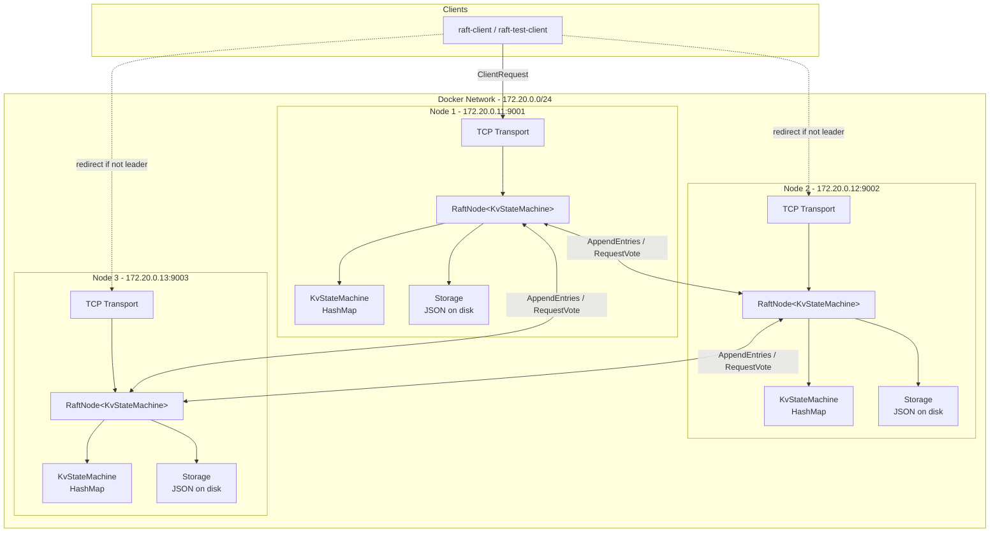
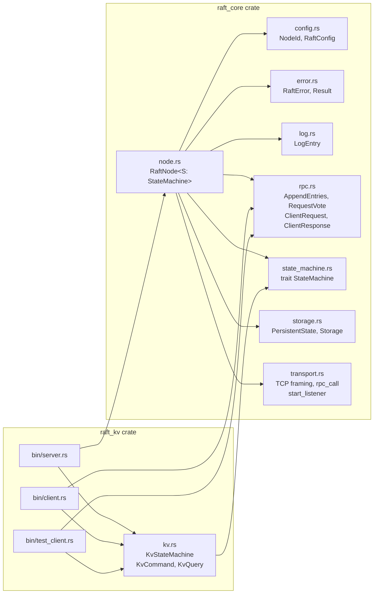
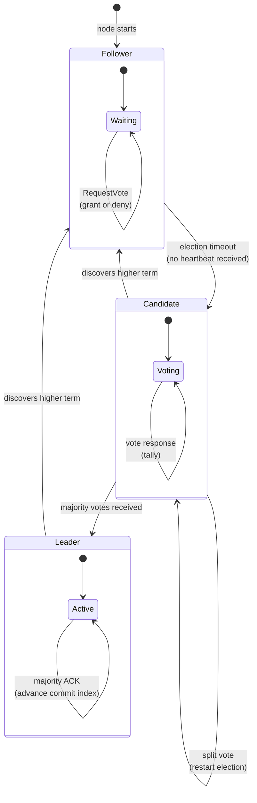
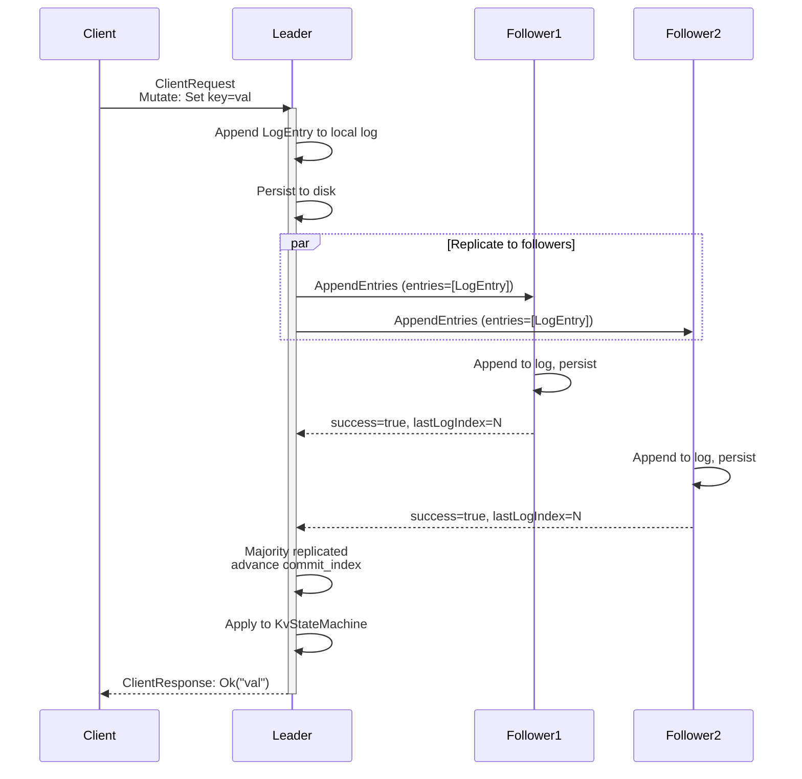
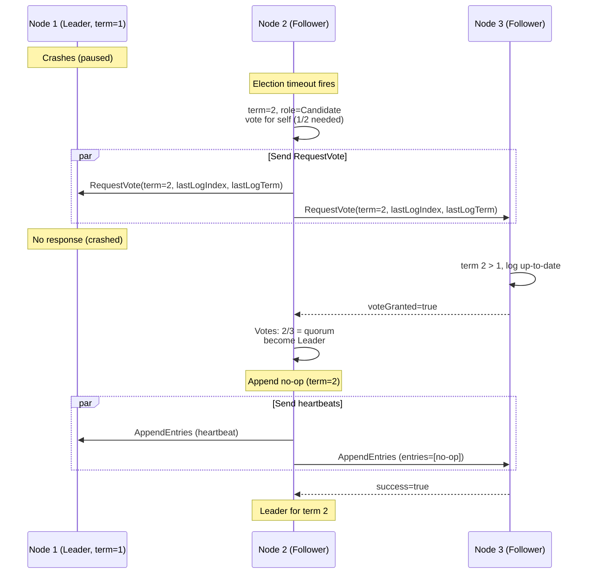
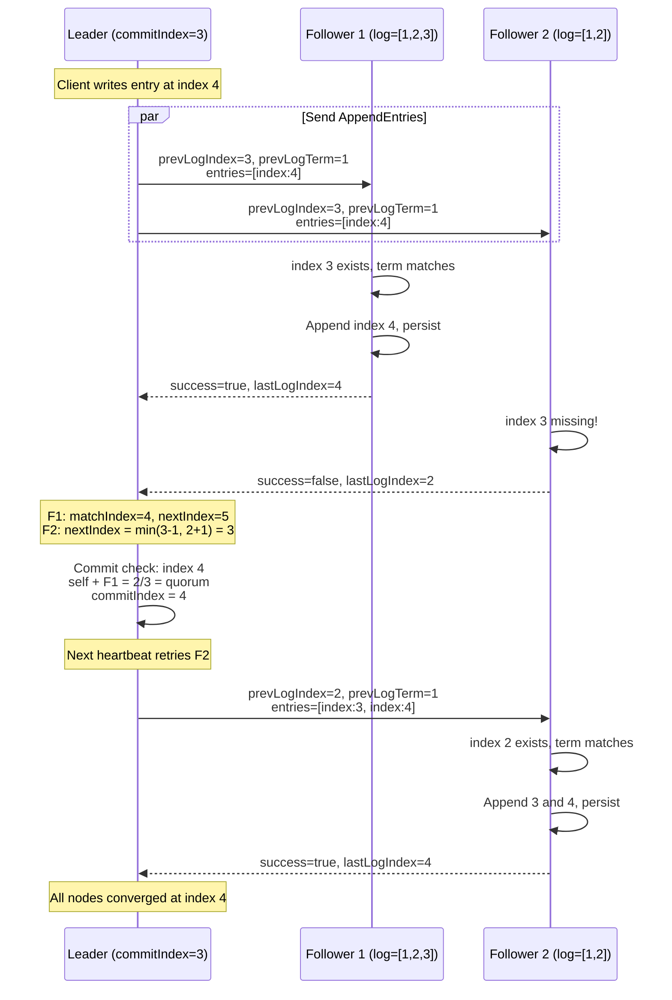

# Raft Example

A Raft consensus protocol implementation in Rust, organized as a two-crate workspace. The core consensus algorithm lives in a reusable library (`raft_core`), while a distributed key/value store (`raft_kv`) demonstrates how to build an application on top of it.

## Table of Contents

- [Raft Example](#raft-example)
  - [Table of Contents](#table-of-contents)
  - [Overview](#overview)
  - [Architecture](#architecture)
    - [High-Level Design](#high-level-design)
    - [Crate Dependency and Module Map](#crate-dependency-and-module-map)
    - [Raft Node State Transitions](#raft-node-state-transitions)
    - [Client Write Flow](#client-write-flow)
    - [Leader Election Sequence](#leader-election-sequence)
    - [Log Replication Sequence](#log-replication-sequence)
    - [raft\_core -- Consensus Library](#raft_core----consensus-library)
    - [raft\_kv -- Key/Value Store Application](#raft_kv----keyvalue-store-application)
  - [Prerequisites](#prerequisites)
  - [Running a Local Cluster](#running-a-local-cluster)
    - [With Docker Compose](#with-docker-compose)
    - [Without Docker](#without-docker)
  - [Using the Client](#using-the-client)
    - [Interactive Client](#interactive-client)
    - [Test Client](#test-client)
  - [Configuration](#configuration)
    - [Test Suite 01 -- Normal Workflow](#test-suite-01----normal-workflow)
    - [Test Suite 02 -- Leader Crash and Data Consistency](#test-suite-02----leader-crash-and-data-consistency)
    - [Test Suite 03 -- Consensus Algorithm](#test-suite-03----consensus-algorithm)
  - [How It Works](#how-it-works)
    - [Leader Election](#leader-election)
    - [Log Replication](#log-replication)
    - [Persistence](#persistence)
    - [Wire Protocol](#wire-protocol)
  - [Extending with a Custom State Machine](#extending-with-a-custom-state-machine)
  - [Design Decisions and Trade-offs](#design-decisions-and-trade-offs)
  - [Limitations](#limitations)

## Overview

This project implements the Raft consensus algorithm as described in the [Raft paper](https://raft.github.io/raft.pdf) by Diego Ongaro and John Ousterhout. It provides:

- A **reusable Raft consensus library** (`raft_core`) with a `StateMachine` trait that decouples the protocol from any specific application.
- A **distributed key/value store** (`raft_kv`) built on top of `raft_core`, with server, interactive client, and test client binaries.
- A **Docker-based test harness** that validates correctness under normal operation, leader crashes, network partitions, and concurrent writes.

## Architecture

### High-Level Design

The system is a 3-node Raft cluster where clients connect to any node. Write requests are forwarded to the leader, replicated to a majority, then applied to the state machine.



### Crate Dependency and Module Map



### Raft Node State Transitions

Each node transitions between three roles based on elections and heartbeats.



### Client Write Flow

How a client Set request propagates through the cluster.



### Leader Election Sequence

When a leader crashes, a follower's election timer fires and it starts an election.



### Log Replication Sequence

Shows how log entries are replicated, including conflict resolution with fast back-up.



### raft_core -- Consensus Library

The `raft_core` crate contains all protocol logic and is independent of any application. Its key abstraction is the `StateMachine` trait:

```rust
pub trait StateMachine: Send + 'static {
    fn apply(&mut self, command: &Option<Vec<u8>>) -> Option<Vec<u8>>;
    fn query(&self, query: &[u8]) -> Option<Vec<u8>>;
}
```

- `apply` is called for every committed log entry, in order. A `None` command represents a protocol-level no-op; `Some(bytes)` carries application-specific data.
- `query` handles read-only requests that do not need to go through the replicated log.

The Raft node is generic over the state machine: `RaftNode<S: StateMachine>`. Log entries carry `Option<Vec<u8>>` payloads rather than application-specific enums, so `raft_core` never needs to know what commands look like.

Dependencies: tokio, serde, serde_json, rand, tracing.

### raft_kv -- Key/Value Store Application

The `raft_kv` crate provides a concrete application:

- **KvCommand** -- `Set { key, value }` and `Delete { key }`, serialized to JSON bytes for the log payload.
- **KvQuery** -- `Get { key }`, used for read-only lookups.
- **KvStateMachine** -- An in-memory `HashMap<String, String>` that implements `StateMachine`.
- **KvResult** -- `Value(Option<String>)`, returned from both apply and query.

Three binaries:

| Binary | Purpose |
|---|---|
| `raft-server` | Starts a Raft node with the K/V state machine |
| `raft-client` | Interactive REPL with automatic leader redirect |
| `raft-test-client` | Single-shot CLI for scripted testing (exit code 0=ok, 1=error, 2=not-leader) |

Dependencies: raft_core, tokio, serde, serde_json, tracing, tracing-subscriber.

## Prerequisites

- Rust 1.85 or later
- Docker and Docker Compose (for cluster testing)

## Running a Local Cluster

### With Docker Compose

Start a 3-node cluster:

```bash
docker compose up --build
```

This creates three containers on a private bridge network:

| Node | Address | Host Port |
|---|---|---|
| node1 | 172.20.0.11:9001 | localhost:9001 |
| node2 | 172.20.0.12:9002 | localhost:9002 |
| node3 | 172.20.0.13:9003 | localhost:9003 |

A leader will be elected within a few seconds. Check the container logs to see which node won the election.

To stop and clean up:

```bash
docker compose down -v
```

### Without Docker

Start three server processes in separate terminals. Create config files (or use those in `config/`) with `127.0.0.1` addresses instead of Docker IPs:

```json
{
  "id": 1,
  "peers": [
    { "id": 1, "addr": "127.0.0.1:9001" },
    { "id": 2, "addr": "127.0.0.1:9002" },
    { "id": 3, "addr": "127.0.0.1:9003" }
  ],
  "election_timeout_min_ms": 1500,
  "election_timeout_max_ms": 3000,
  "heartbeat_interval_ms": 500
}
```

Then run each node:

```bash
# Terminal 1
cargo run --release --bin raft-server -- config/node1_local.json

# Terminal 2
cargo run --release --bin raft-server -- config/node2_local.json

# Terminal 3
cargo run --release --bin raft-server -- config/node3_local.json
```

## Using the Client

### Interactive Client

```bash
cargo run --release --bin raft-client -- 127.0.0.1:9001
```

Supported commands:

```
> set mykey myvalue
myvalue
> get mykey
myvalue
> delete mykey
myvalue
> get mykey
(nil)
> quit
bye!
```

The client automatically follows `NotLeader` redirects. If you connect to a follower, the request is transparently routed to the current leader.

### Test Client

For scripted use:

```bash
# Set a value
raft-test-client 127.0.0.1:9001 set foo bar

# Get a value
raft-test-client 127.0.0.1:9001 get foo

# Delete a value
raft-test-client 127.0.0.1:9001 delete foo
```

Environment variables:
- `NO_REDIRECT=1` -- disable automatic leader redirect following (useful for determining which node is the leader).

Exit codes:
- `0` -- success (value printed to stdout)
- `1` -- error (message on stderr)
- `2` -- not the leader (leader address printed to stdout)

## Configuration

Each node takes a JSON configuration file:

```json
{
  "id": 1,
  "peers": [
    { "id": 1, "addr": "172.20.0.11:9001" },
    { "id": 2, "addr": "172.20.0.12:9002" },
    { "id": 3, "addr": "172.20.0.13:9003" }
  ],
  "election_timeout_min_ms": 1500,
  "election_timeout_max_ms": 3000,
  "heartbeat_interval_ms": 500
}
```

| Field | Description |
|---|---|
| `id` | Unique node identifier (must match one entry in `peers`) |
| `peers` | Full cluster membership including this node |
| `election_timeout_min_ms` | Minimum election timeout in milliseconds |
| `election_timeout_max_ms` | Maximum election timeout in milliseconds |
| `heartbeat_interval_ms` | Leader heartbeat interval in milliseconds |

The election timeout should be significantly larger than the heartbeat interval (the paper recommends at least a 10x ratio). Each election cycle picks a random timeout in `[min, max]` to avoid split votes.

### Test Suite 01 -- Normal Workflow

Validates basic cluster operation under healthy conditions:

- A leader is elected after startup
- Set, Get, and Delete operations work correctly
- Key values can be updated
- Multiple keys can be stored and retrieved independently
- Deleting a key makes subsequent Gets return `(nil)`
- Getting a non-existent key returns `(nil)`
- Requests to followers are automatically redirected to the leader
- Bulk writes (10 keys) are all readable and consistent

### Test Suite 02 -- Leader Crash and Data Consistency

Validates correctness when the leader fails:

1. Write data to the current leader (3 key/value pairs)
2. Verify the data is readable
3. Crash the leader (Docker container pause -- freezes all processes)
4. Wait for a new leader to be elected from the remaining 2 nodes
5. Verify the new leader is a different node
6. Read pre-crash data from the new leader -- all 3 keys must be intact
7. Write new data to the new leader while the old leader is down
8. Update a pre-crash key on the new leader
9. Restore the old leader (Docker container unpause)
10. Wait for the cluster to stabilize
11. Verify all data converged: pre-crash data, updated data, and post-crash data are all consistent
12. Verify the cluster is fully operational by writing new data

This test proves there is no data loss during leader failover and no split-brain after recovery.

### Test Suite 03 -- Consensus Algorithm

Validates advanced consensus scenarios:

- **Minority partition (3.1)**: Isolate 1 follower. The cluster still has 2/3 majority and can serve reads and writes. After the follower rejoins, data written during the partition is consistent.

- **No write quorum (3.2)**: Isolate both followers, leaving the leader alone. Writes correctly fail with a timeout because the leader cannot achieve majority replication. After restoring followers, the cluster recovers.

- **Rapid leadership changes (3.3)**: Crash leader #1, wait for leader #2 to be elected, write data, restore leader #1, crash leader #2, wait for leader #3 to be elected. Data written after the first crash survives both leadership transitions.

- **Final convergence (3.4)**: After all partitions are healed, verify that all historical data from previous test steps is intact and readable.

- **Concurrent writes (3.5)**: Send 20 writes in parallel to a stable leader. All 20 must be committed and readable.

- **Delete and re-create (3.6)**: Set a key, delete it (verify it returns nil), then set it again with a new value. The full lifecycle works correctly.

## How It Works

### Leader Election

When a follower's election timer expires without receiving a heartbeat, it transitions to candidate, increments its term, votes for itself, and sends `RequestVote` RPCs to all peers in parallel. If it receives votes from a majority, it becomes leader. The election timeout is randomized between `election_timeout_min_ms` and `election_timeout_max_ms` to reduce the probability of split votes.

On becoming leader, the node immediately appends a no-op entry (Section 5.4.2 of the paper) and sends heartbeats to all followers to establish authority and prevent competing elections.

Vote granting follows Section 5.4.1: a node grants its vote only if it has not voted in the current term (or already voted for the same candidate) and the candidate's log is at least as up-to-date as the voter's log. "Up-to-date" is determined by comparing the last log entry's term first, then index.

### Log Replication

The leader appends client write commands to its local log, then replicates them to followers via `AppendEntries` RPCs. Each RPC includes the term and index of the entry immediately preceding the new entries, allowing followers to detect gaps or conflicts.

On conflict, the follower truncates its log from the point of divergence. The leader uses a fast back-up optimization: instead of decrementing `nextIndex` by 1 on each failed `AppendEntries`, it jumps to the follower's reported `last_log_index + 1`.

Once a majority of nodes have replicated an entry, the leader advances its commit index. Only entries from the current term can advance the commit index (Section 5.4.2). Committed entries are then applied to the state machine in order.

### Persistence

The following state is persisted to disk as a JSON file after every mutation (Raft paper Figure 2):

- `current_term` -- the latest term the node has seen
- `voted_for` -- the candidate this node voted for in the current term (or null)
- `log` -- the full log of entries

Writes use a write-to-temporary-then-rename pattern for crash safety.

### Wire Protocol

All RPC communication uses TCP with a simple framing protocol:

```
+-------------------+--------------------+
| 4 bytes (BE u32)  |   JSON payload     |
|   payload length  |   (RpcMessage)     |
+-------------------+--------------------+
```

Each TCP connection handles exactly one request-response pair. This simplifies the implementation at the cost of connection overhead. The maximum payload size is 16 MB.

## Extending with a Custom State Machine

To build a different replicated application on `raft_core`, implement the `StateMachine` trait:

```rust
use raft_core::state_machine::StateMachine;

struct MyStateMachine {
    // your application state
}

impl StateMachine for MyStateMachine {
    fn apply(&mut self, command: &Option<Vec<u8>>) -> Option<Vec<u8>> {
        let payload = match command {
            Some(p) => p,
            None => return None, // no-op, ignore
        };
        // Deserialize your command from `payload`, apply it,
        // and return a serialized result.
        todo!()
    }

    fn query(&self, query: &[u8]) -> Option<Vec<u8>> {
        // Deserialize the query, look up your state,
        // and return a serialized result.
        todo!()
    }
}
```

Then wire it up in your server binary:

```rust
use raft_core::config::RaftConfig;
use raft_core::node::RaftNode;
use raft_core::storage::Storage;
use raft_core::transport;
use tokio::sync::mpsc;

#[tokio::main]
async fn main() {
    let config: RaftConfig = /* load from file */;
    let storage = Storage::new(&data_dir, config.id).unwrap();
    let state_machine = MyStateMachine::new();
    let (rpc_tx, rpc_rx) = mpsc::channel(256);

    tokio::spawn(async move {
        transport::start_listener(config.self_addr(), rpc_tx).await.unwrap();
    });

    let node = RaftNode::new(config, storage, state_machine, rpc_rx).unwrap();
    node.run().await.unwrap();
}
```

Client RPCs use `ClientCommand::Mutate { payload }` for writes and `ClientCommand::Query { payload }` for reads. The payload is your application's serialized command or query.

## Design Decisions and Trade-offs

**Generic state machine trait** -- The `StateMachine` trait uses opaque `Vec<u8>` payloads rather than an associated type or generic parameter on `LogEntry`. This avoids propagating a type parameter through every struct in the protocol while still allowing any serialization format.

**One TCP connection per RPC** -- Each request opens a new connection. This is simple and avoids multiplexing complexity. For higher throughput, connection pooling or a persistent connection model could be added.

**JSON for persistence and wire format** -- Both on-disk state and network messages use JSON. This makes debugging straightforward (you can inspect state files directly) but is less efficient than a binary format.

**Docker pause for crash simulation** -- Tests use `docker pause` / `docker unpause` to simulate node crashes. This freezes all processes in the container instantly, which is a faithful simulation of a sudden crash. Unlike `docker stop`, it does not give the process a chance to shut down gracefully.

**No snapshot support** -- Without log compaction, the log grows without bound. This is acceptable for an educational implementation but would need to be addressed for production use.

## Limitations

- **No log compaction or snapshots** -- The log grows indefinitely. Long-running clusters will eventually use excessive memory and disk.
- **No cluster membership changes** -- The cluster topology is fixed at startup. Adding or removing nodes requires stopping the cluster.
- **No linearizable reads** -- Read-only queries are served from the leader's committed state without a read-index protocol. Stale reads are possible if a leader has been partitioned but has not yet stepped down.
- **No pre-vote protocol** -- A partitioned node will increment its term on each election timeout. When it rejoins, it may disrupt the current leader by forcing a new election with its higher term.
- **Single-threaded event loop** -- The Raft node processes events sequentially. RPC handling and log replication share the same tokio task.
